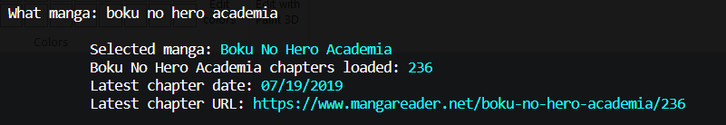

It's already midnight and I just finished coding the prototype of my NodeJS application. 

Anyway, I would like to meet my app, <a href="https://github.com/ThanMatt/manga-update-checker" target="_blank">Mauch</a>. Mauch stands for Manga Update Checker, so it just basically gives you the latest update of your favorite manga let's say Boku No Hero Academia

<i>Mauch in action</i>

It sounds convenient because you don't have to open your web browser just to check if are there any updates, you could just install this and run it on your terminal then bam!

This is just a prototype yet, additional details are in this <a href="https://github.com/ThanMatt/manga-update-checker" target="_blank">link</a>. I'll probably add more stuff.